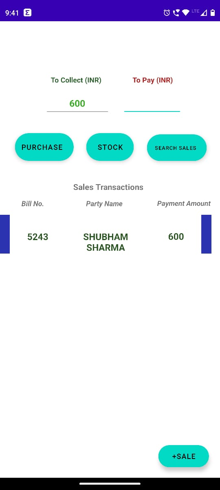
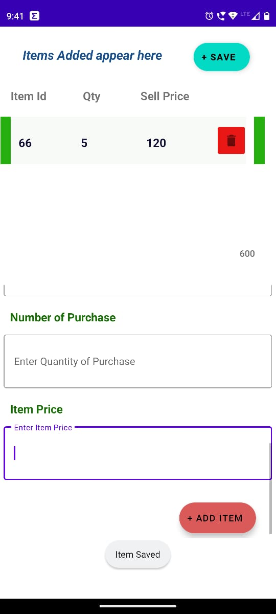

# GrowBusiness-Inventory Management System (IMS) - Android App

## Overview

Inventory Management System (IMS) is an Android application designed to streamline and simplify inventory management tasks for businesses. With a user-friendly mobile interface, businesses can manage sales, purchases, customer interactions, and get real-time stock valuations at their fingertips.

## Features

- **Real-time Stock Tracking**: Stay updated with accurate inventory levels. Prevent stock-outs or overstocking.
- **Sales Management**: Record and track all your sales data seamlessly.
- **Purchases**: Manage your procurements efficiently, with automated inventory updates.
- **Customer Management**: Maintain a database of your customers, track purchase history, and manage interactions.
- **Stock Valuation**: Get an accurate valuation of your inventory anytime.
- **User-friendly Interface**: Designed keeping in mind ease-of-use, for all business sizes.

## Tech Stack

- **Programming Language**: Kotlin
- **Framework**: Android Development SDK
- **Database**: SQLite with ROOM Persistence Library
- **Asynchronous Operations**: Kotlin Coroutines
